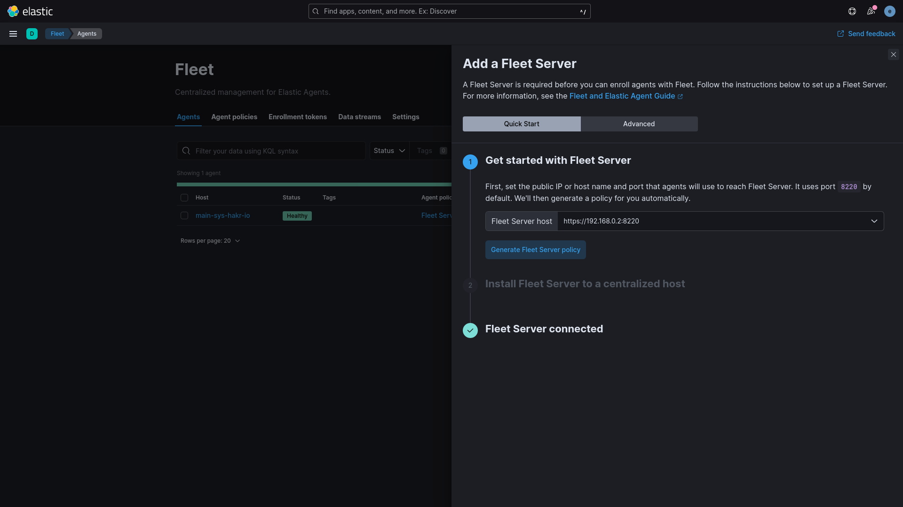
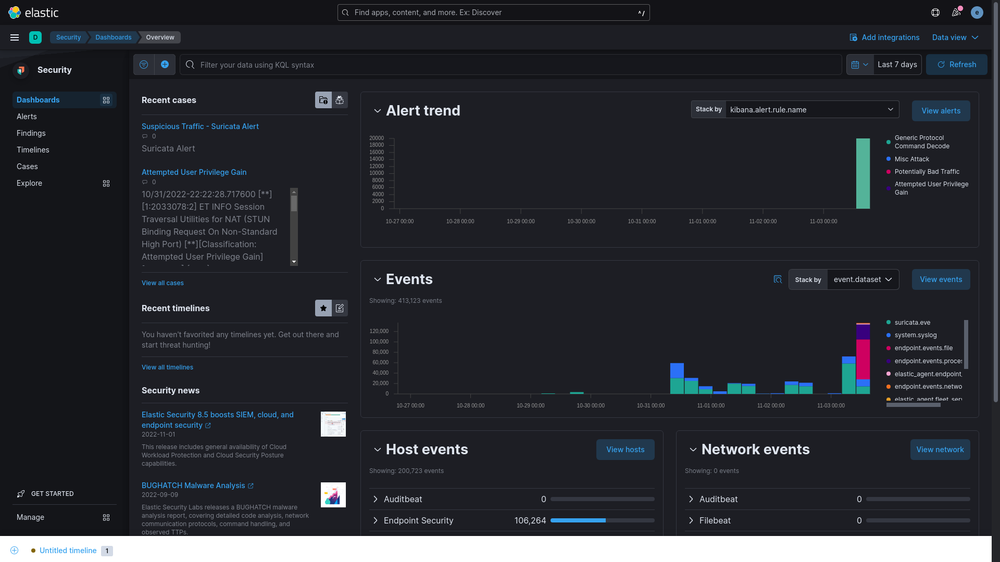

> **Note**  
> Using podman-compose.
>
> curl -o /usr/local/bin/podman-compose https://raw.githubusercontent.com/containers/podman-compose/devel/podman_compose.py
>
> chmod +x /usr/local/bin/podman-compose
>
> alias podman-compose=/usr/local/bin/podman-compose
>

```sh
sudo sysctl -w vm.max_map_count=262144
reboot

# create .env
tee ./.env<<EOF
ELASTIC_VERSION=8.5.2
ELASTIC_USERNAME=elastic
ELASTIC_PASSWORD='    '
LOGSTASH_INTERNAL_PASSWORD='    '
KIBANA_SYSTEM_PASSWORD='    '
EOF

podman-compose up -d
podman-compose exec kibana bin/kibana-encryption-keys generate -f
#copy and paste keys into kibana.yml
```
#

```yaml
## X-Pack settings
## see https://www.elastic.co/guide/en/elasticsearch/reference/current/security-settings.html
#
## X-Pack security credentials
#
xpack.encryptedSavedObjects.encryptionKey: < .... >
xpack.reporting.encryptionKey: < .... >
xpack.security.encryptionKey: < .... >
```
#
```sh
podman-compose down kibana && podman-compose up kibana -d
```
http://localhost:5601

```sh
# generate new password for elastic
podman-compose exec elasticsearch bin/elasticsearch-reset-password --batch --user elastic
```

## Fleet/Agent.

https://www.elastic.co/guide/en/fleet/master/fleet-server.html



```sh
sudo curl -L -O https://artifacts.elastic.co/downloads/beats/elastic-agent/elastic-agent-8.5.0-linux-x86_64.tar.gz
sudo tar xzvf elastic-agent-8.5.0-linux-x86_64.tar.gz
sudo ./elastic-agent-8.5.0-linux-x86_64/elastic-agent install \
--fleet-server-es=http://localhost:9200 \
--fleet-server-service-token=<!INSERT THE GENERATED TOKEN HERE!> \
--fleet-server-policy=fleet-server-policy
```

```pwsh
#For windows endpoints, open powershell as an admin and install the agent with:
$ProgressPreference = 'SilentlyContinue'
Invoke-WebRequest -Uri https://artifacts.elastic.co/downloads/beats/elastic-agent/elastic-agent-8.5.0-windows-x86_64.zip -OutFile elastic-agent-8.5.0-windows-x86_64.zip
Expand-Archive .\elastic-agent-8.5.0-windows-x86_64.zip
cd elastic-agent-8.5.0-windows-x86_64
.\elastic-agent.exe install `
  --fleet-server-es=http://localhost:9200 `
  --fleet-server-service-token=<!INSERT THE GENERATED TOKEN HERE!> `
  --fleet-server-policy=fleet-server-policy
```

## Elastic Agent

[](https://www.youtube.com/watch?v=pnGXjljuEnY)

## Suricata
https://hub.docker.com/r/jasonish/suricata/tags

```sh
podman pull docker.io/jasonish/suricata:latest
```
#

```sh
podman run --rm -it --name <+changeme+> --net=host \
--cap-add=net_admin --cap-add=net_raw --cap-add=sys_nice \
-d -v <+changeme+>:/var/log/suricata \
jasonish/suricata:latest -i <+changeme+>
```

#
```sh
podman ps -a
podman exec <some_name> dnf update -y
podman exec <some_name> suricata-update update-sources
podman exec <some_name> suricata-update

#Optional
#disable stream alerts
podman exec -it <some_name> /bin/bash
touch /etc/suricata/disable.conf
echo "group:stream-events.rules" | tee -a /etc/suricata/disable.conf
chown -R suricata:suricata /etc/suricata
suricata-update
exit

#verify events/alerts capture:
tail -f <path to directory>/fast.log
tail -f <path to directory>/eve.json | jq
```

https://suricata.io/

Add the suricata integration in the elastic agent policy, place the correct path to eve.json

https://docs.elastic.co/en/integrations/suricata

## Custom Logs Integration

https://docs-staging.elastic.co/integrations/log


## Elastic Defend


https://www.elastic.co/security

https://www.elastic.co/training/security-quick-start



Product Overview - Configuring Endpoint Security Policy

[](https://www.youtube.com/watch?v=Wnx5b9MxylA)

Happy Threat [Hunting](https://eqlplayground.io/)

[](https://www.youtube.com/watch?v=1mWzwWGfJNo)

    
Convert running containers with podman for kubectl use

www.redhat.com/sysadmin/compose-kubernetes-podman
```sh
sudo podman generate kube -s -f new_kubernetes_service.yaml <container_name> <container_name>

The -s in the previous command signifies that Podman will generate service for this pod. 
The -f option allows us to save the generated YAML into a file. Otherwise, the output is sent to stdout, 
where it can be redirected to a file.

```
