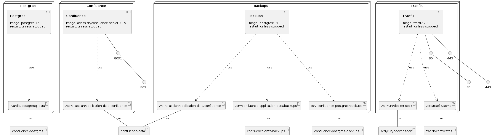

# Confluence with Let's Encrypt in a Docker Compose

Run `confluence-restore-application-data.sh` to restore application data if needed.

Run `confluence-restore-database.sh` to restore database if needed.

Deploy Confluence server with a Docker Compose using the command:

`docker compose -f confluence-traefik-letsencrypt-docker-compose.yml -p confluence up -d`

# Infrastructure Model

