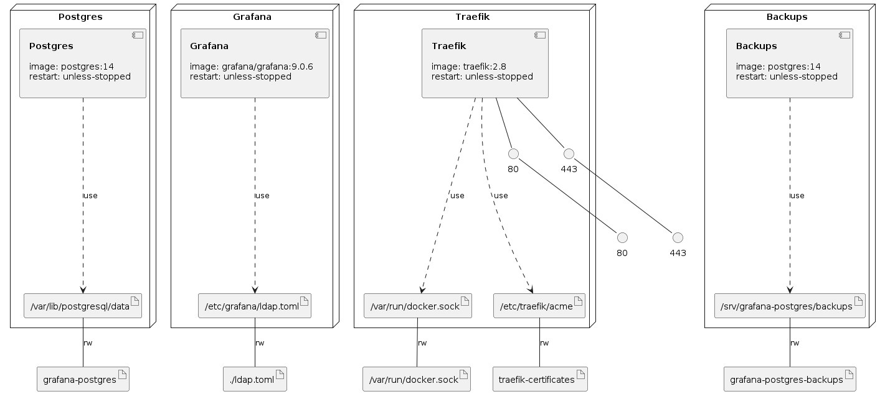

# Grafana with Let's Encrypt in a Docker Compose

Note that `ldap.toml` should be in the same directory with `grafana-traefik-letsencrypt-docker-compose.yml`

Edit `ldap.toml` according to your requirements.

Run `grafana-restore-database.sh` to restore database if needed.

Deploy Grafana server with a Docker Compose using the command:

`docker compose -f grafana-traefik-letsencrypt-docker-compose.yml -p grafana up -d`

# Infrastructure Model

