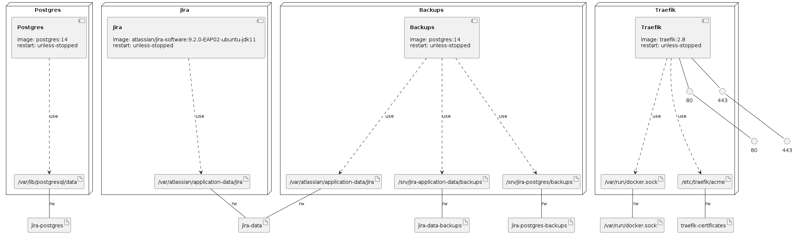

# Jira with Let's Encrypt in a Docker Compose

Run `jira-restore-application-data.sh` to restore application data if needed.

Run `jira-restore-database.sh` to restore database if needed.

Deploy Jira server with a Docker Compose using the command:

`docker compose -f jira-traefik-letsencrypt-docker-compose.yml -p jira up -d`

# Infrastructure Model

