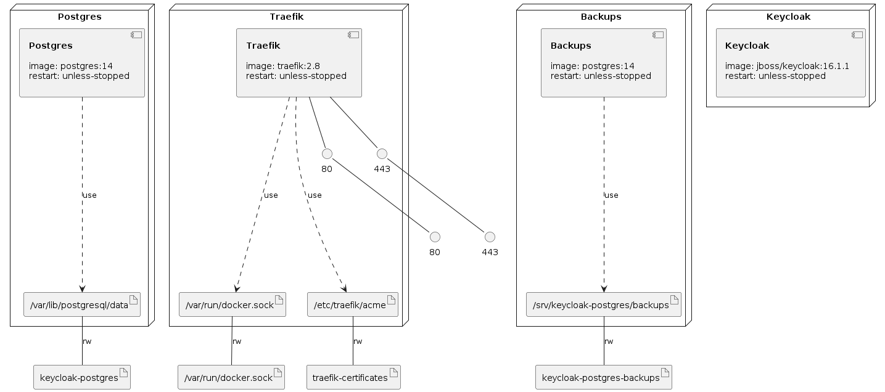

# Keycloak with Let's Encrypt in a Docker Compose

Run `keycloak-restore-database.sh` to restore database if needed.

Deploy Keycloak server with a Docker Compose using the command:

`docker compose -f keycloak-traefik-letsencrypt-docker-compose.yml -p keycloak up -d`

# Infrastructure Model

