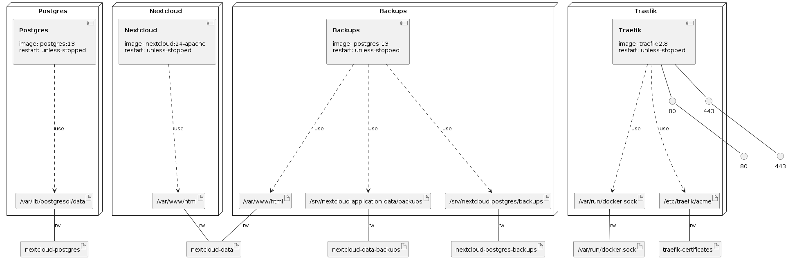

# Nextcloud with Let's Encrypt in a Docker Compose

Run `nextcloud-restore-application-data.sh` to restore application data if needed.

Run `nextcloud-restore-database.sh` to restore database if needed.

Deploy nextcloud server with a Docker Compose using the command:

`docker compose -f nextcloud-traefik-letsencrypt-docker-compose.yml -p nextcloud up -d`

# Infrastructure Model

