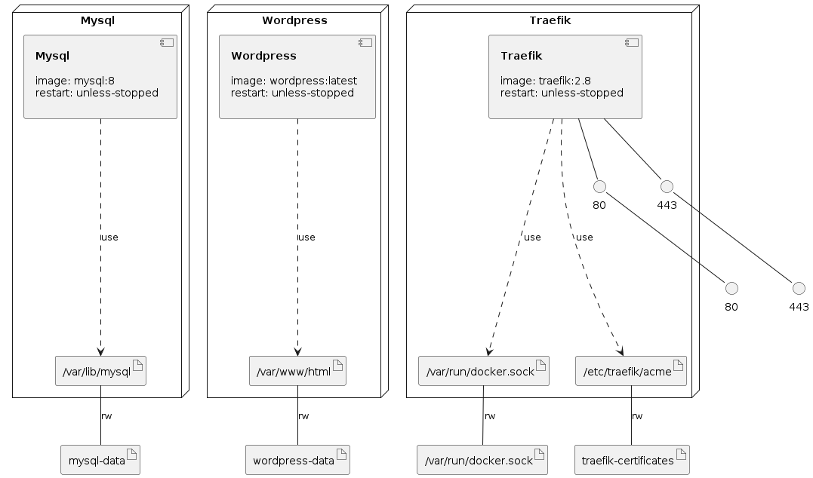

# WordPress with Let's Encrypt in a Docker Compose

Deploy WordPress server with a Docker Compose using the command:

`docker compose -f wordpress-traefik-letsencrypt-docker-compose.yml -p wordpress up -d`

# Infrastructure Model

